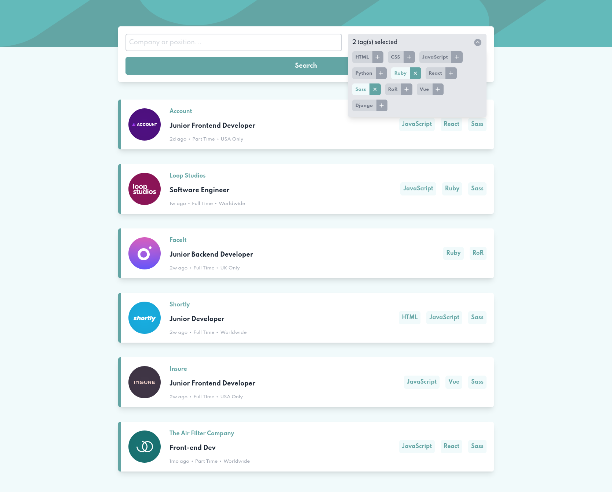

# React Job Listing App

Clique no link para ver o projeto: [React Job Listing](https://leottx.github.io/react-job-listing-app/)

## Overview

Esse projeto simula uma plataforma para busca de vagas na área de TI. Nessa página é possível filtrar os anúncios utilizando apenas tags, nome da empresa, posição pretendita ou ainda compor a pesquisa com ambas as opções para obter resultados mais objetivos.

O design e ideia da aplicação foi promovido pelo [Frontend Mentor]() que é um site com desafios para pessoas programadoras.

Foram utilizados a biblioteca [CRA](https://create-react-app.dev/) e o framework [TailwindCSS](https://tailwindcss.com/) para construção desse projeto. A escolha de utilizar um framework ao invés do CSS puro se deu por motivos de aprendizagem. O TailwindCSS tem crescido muito e se demonstrado uma alternativa versátil para criação de layouts responsivos com poucas desvantagens quanto a capacidade de customização que, em geral, os frameworks de CSS carecem.

## Screenshots

